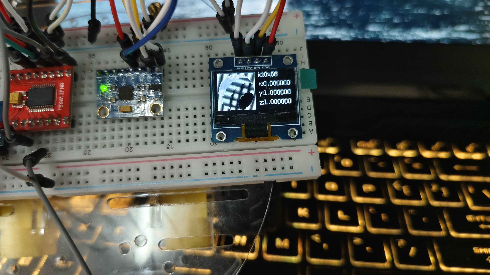

*20240317*

MPU6050的DMP库已经移植成功，再配合之前u8g2的移植，已经具备实现姿态显示的条件，也就是在OLED中画一个立体球，它根据陀螺仪的数据再利用投影关系来显示不同的角度。这样的方法也叫做 `Half Lambert` 。

但是，当我想要将这二者合在一起，也就是将陀螺仪与OLED串通一气时，出现了问题。
markdown怎么插入图片和视频

<video controls>
  <source src="video_20240317_162931.mp4" type="video/mp4">
</video>

后来发现好像是flash空间不足，于是我开始着手削减u8g2和empl。

<video controls>
  <source src="video_20240317_165732.mp4" type="video/mp4">
</video>

空间的问题解决了，但是屏幕依旧不刷新。

接下来的开发中，我觉得应该尝试使用中断来读取数据，进一步研究u8g2库的缓存模式，不要再在 `Draw_Sphere` 里使用clearbuffer这样的语句，这会使屏幕帧率大大降低。
而且对于一些浮点计算，试着寻找其他的替代方案，或许可以看看stm32官方推出的那个。

还有另一种解决方案，就是同时使用stm32的两个i2c接口，这样可以解决总线占用和同步的问题。
